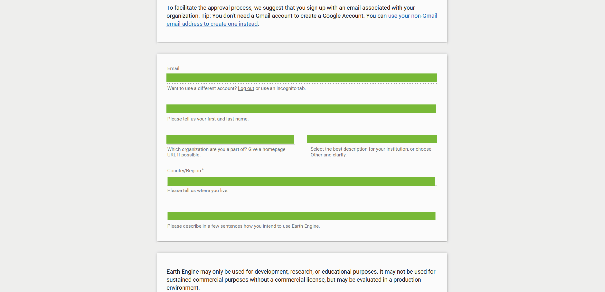
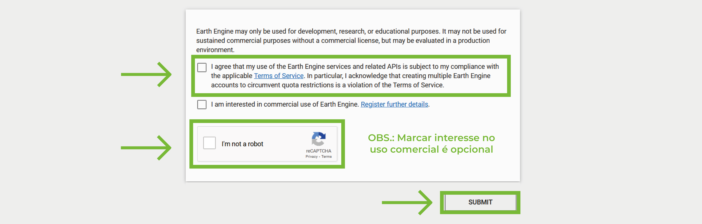
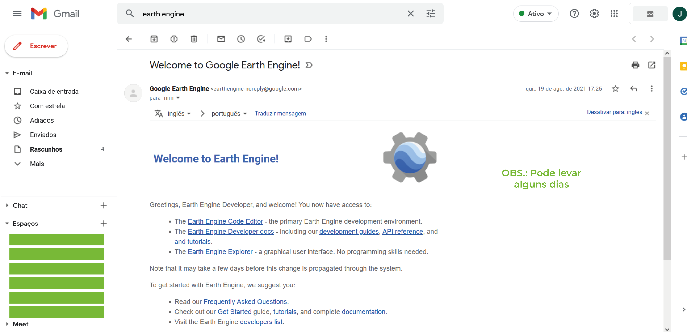

```{r setup, include=FALSE}
options(htmltools.dir.version = FALSE)
knitr::opts_chunk$set(
  fig.width=9, fig.height=3.5, fig.retina=3,
  out.width = "100%",
  cache = FALSE,
  echo = TRUE,
  message = FALSE, 
  warning = FALSE,
  hiline = TRUE
)
```

```{r xaringan-themer, include=FALSE, warning=FALSE}
library(xaringanthemer)
style_mono_light(
  base_color = "#79B937",
  header_font_google = google_font("Lato"),
    text_font_google   = google_font("Roboto", "300", "300i"),
  code_font_google   = google_font("Roboto"))

```
name: cadastroGEE

### CADASTRO GOOGLE EARTH ENGINE

**1.** Acessar [o site do Google Earth Engine](https://earthengine.google.com/) e clicar em **Sign Up**

```{r, echo=FALSE}
knitr::include_graphics("signup1.png")
```

---
name: contagoogle
<br>
**2.** Fazer login na conta Google .left-column[
**OBS.: De preferência, usar uma conta institucional.** <br>
<br>
**É preciso ter/criar uma conta Google (que não requer um email Gmail).**
].right-column[
```{r, echo=FALSE, out.height="500", out.width= "auto", fig.align = "center"}

```

]
---
<br>
**3.** Preencher as informações solicitadas

```{r, echo=FALSE, out.height="500", out.width= "auto", fig.align = "center"}

```
---
<br>
**4.** Aceitar o termo de serviço / Clicar CAPTCHA / Enviar cadastro

```{r, echo=FALSE}

```
---
<br>
**5.** Aguardar

```{r, echo=FALSE}

```
---
class: center, middle

### OBRIGADA!

Qualquer dúvida enviar e-mail para:
<br>
**julia.cansado@usp.br** <br>
**ma.hirye@alumni.usp.br** <br>
**tmicheleti@usp.br **
<br>


